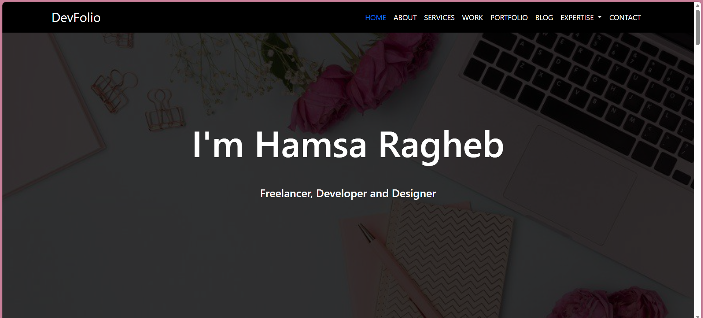

# 💼 DevFolio | Personal Portfolio Website

A modern, responsive, and professional portfolio website built using HTML5, CSS3, Bootstrap 5, and JavaScript. The project showcases personal information, technical skills, services, portfolio projects, testimonials, blog posts, and contact information through a clean and interactive user interface.

## 🚀 Live Demo

🔗 [Live Preview](YOUR_GITHUB_PAGES_LINK)

---

## 📸 Preview



---

## 🎯 Project Overview

DevFolio is a personal portfolio website designed to highlight professional experience, technical skills, projects, and services in a visually appealing and responsive layout.

The website follows modern UI/UX principles and demonstrates front-end development skills using Bootstrap components, custom CSS styling, and interactive elements.

---

## ✨ Features

### 👨‍💻 Personal Branding

- Professional hero section
- Personal introduction
- Career overview
- Contact information

### 📊 Skills Showcase

- Animated progress bars
- Technical skills presentation
- Responsive layout

### 🛠️ Services Section

- Service cards with icons
- Hover effects and animations
- Bootstrap grid system

### 📁 Portfolio Section

- Project showcase cards
- Interactive hover effects
- Responsive portfolio gallery

### 📈 Statistics Section

- Work achievements
- Experience highlights
- Client statistics
- Award counters

### 💬 Testimonials

- Client feedback section
- Professional presentation layout

### 📝 Blog Section

- Blog cards
- Author information
- Reading time indicators

### 📞 Contact Section

- Contact form
- Social media links
- Contact information cards

### 📱 Responsive Design

- Mobile-first design
- Desktop optimization
- Tablet support
- Cross-browser compatibility

---

## 🛠️ Technologies Used

### Front-End

- HTML5
- CSS3
- JavaScript
- Bootstrap 5

### Libraries & Tools

- Font Awesome
- Google Fonts
- Bootstrap Components

---

## 📂 Project Structure

```bash
DevFolio/
│
├── README.md
├── preview.png
├── index.html
│
├── css/
│   ├── style.css
│   └── bootstrap.min.css
│
├── js/
│   └── bootstrap.bundle.min.js
│
├── images/
│
└── assets/
```

---

## 🎨 Main Sections

### Home
Professional landing page with introduction and navigation.

### About
Personal information, profile details, and technical skills.

### Services
Showcase of offered services with interactive cards.

### Work Statistics
Achievement counters and professional highlights.

### Portfolio
Collection of featured projects and work samples.

### Testimonials
Client feedback and recommendations.

### Blog
Recent articles and content showcase.

### Contact
Interactive contact form and social media links.

---

## 📈 Performance Highlights

- Semantic HTML structure
- Clean and maintainable code
- Bootstrap responsive grid system
- Optimized CSS styling
- Smooth user experience
- Mobile-friendly design

---

## 🔧 Installation

```bash
git clone https://github.com/HamsaRagheb/DevFolio.git

cd DevFolio
```

Open `index.html` directly in your browser or run using VS Code Live Server.

---

## 📚 What I Learned

- Building responsive websites with Bootstrap 5
- Creating professional portfolio layouts
- Working with Bootstrap components
- Designing reusable UI sections
- Implementing responsive navigation
- Structuring scalable front-end projects
- Improving UI/UX design practices

---

## 👩‍💻 Author

**Hamsa Ragheb**

Front-End Developer

### Connect With Me

- GitHub: https://github.com/HamsaRagheb
- LinkedIn: https://www.linkedin.com/in/hamsa-ragheb/
- Email: hamssaraghebzikrallah@gmail.com

---

## ⭐ Support

If you found this project useful, consider giving it a ⭐ on GitHub.
